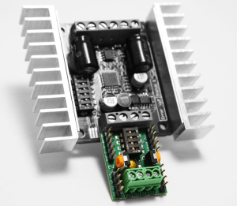

## Table of Contents
- [Example Firmware Task](#example-firmware-task)
  - [Working with the STM32](#working-with-the-stm32)
    - [Setting Up the Environment](#setting-up-the-environment)
    - [Creating a command](#creating-a-command)
  - [Testing and Debugging](#testing-and-debugging)


# Example Firmware Task
| :white_check_mark: | Interface with Motion Controller Using the STM32 F7 Board |
|--|--|

The motors for the Rover wheels will use the [Kangaroo motion controller](https://www.dimensionengineering.com/products/kangaroo) and [Sabertooth 2x12 motor driver](https://www.dimensionengineering.com/products/sabertooth2x12) from Dimension Engineering for control. The Kangaroo is attached to the Sabertooth and provides position and speed control using feedback from the motor. 

<br>*Kangaroo (bottom) installed in Sabertooth (top)*

Packet serial will be used to send commands to the Kangaroo which are described in the [Packet Serial Reference](https://www.dimensionengineering.com/datasheets/KangarooPacketSerialReference.pdf) from Dimension Engineering. The purpose of this task is to create a library that provides simplified commands for commanding the Kangaroo (Move at x speed, move x distance, etc...) from the STM32 F7 Nucleo board.

The full code can be found in the ugrt_stm_lib repository in the KangarooDevelopment branch under [KangarooDriver.c](https://github.com/ugrt/ugrt_stm_lib/blob/KangarooDevelopment/KangarooDriver.c) and [KangarooDriver.h](https://github.com/ugrt/ugrt_stm_lib/blob/KangarooDevelopment/KangarooDriver.h).

## Working with the STM32
### Setting Up the Environment
Since the STM32 is being used, the project must be created using the STM32 Cube IDE. When you start a new project, you are asked to select a target MCU or Board. This task uses the STM32 Nucleo-F767ZI.


When you create the project, it will ask if you want to open the Device Configuration Tool persective. If you say yes, the configuration tool will open where you can choose which pins of the board you will use, what those pins will be used for, and other settings so it can generate code for you making it easier to use those ports in your own code.


Defining some macros in the header file for constants you will use in the program can make configuring it later much easier. For example, the max length of a command sent to the Kangaroo will be 27 bits, so:

```C
#define CMD_DATA_SIZE 27
```

Enums were also created to make the code easier to understand since the numbers used for the Kangaroo commands won't mean much unless you have the documentation next to you. For example, this enum was defined for the various move-related commands documented in the Packet Serial Reference:

```C
/*
 * Enum: KangarooMove
 * ---------------------
 * Possible motions for KANGAROO_CMD_MOVE command
 */
typedef enum KangarooMove {
	KANGAROO_MOVE_POSITION = 1,
	KANGAROO_MOVE_POSITION_INCREMENTAL = 65,
	KANGAROO_MOVE_SPEED = 2, 	// If no position param included, this is speed limit
	KANGAROO_MOVE_SPEED_INCREMENTAL = 66,
	KANGAROO_MOVE_RAMPSPEED = 3,// Speed ramping, does not affect position control
}KangarooMove;
```

### Creating a command
The STM32 Cube IDE also generates some HAL (hardware abstraction layer) functions with basic functionality. For example, the ```HAL_UART_Transmit()``` function transmits data over a specified serial port. A wrapper function was made with simple error checking:

```C
/*
 * Function: kangaroo_writeSerial
 * ------------------------------
 * Send buffer over serial
 *
 * serialPort: The serial port to write to
 * buffer: Data buffer to send
 */
KangarooError kangaroo_writeSerial(UART_HandleTypeDef *serialPort, uint8_t *buffer, size_t bufferSize) {
	return HAL_UART_Transmit(serialPort, buffer, bufferSize,
			KANGAROO_TIMEOUT) != HAL_OK ?
			KANGAROO_STM_UART_ERROR : KANGAROO_NO_ERROR;
}
```

Then, a generic command function was made to handle the creation of the command structure every command uses.


```C
/*
 * Function: kangaroo_sendCommand
 * ---------------------------------
 * Write command data to buffer and sends to serial
 *
 * kangarooChannel: KangarooChannel struct
 * cmd: KangarooCommand command to send
 * cmdData: command parameters to load to buffer
 * length: length of cmdData
 */
KangarooError kangaroo_sendCommand(KangarooChannel kangarooChannel, KangarooCommand cmd, uint8_t *cmdData, size_t length) {
	size_t i = 0;
	uint8_t buffer[KANGAROO_MAX_BUFFER_LENGTH] = {0};

    // Specify what command is used (from cmd var)
	buffer[i++] = kangarooChannel.address;
	buffer[i++] = (uint8_t) cmd;
	buffer[i++] = length;

    // Fill packet with command data passed from caller function
	for (size_t j = 0; j < length; j++) {
		buffer[i++] = cmdData[j];
	}

    // CRC is used to track if a packet was received
	uint16_t crc = kangaroo_crc(buffer, i);
	buffer[i++] = crc & 0x7f;
	buffer[i++] = (crc >> 7) & 0x7f;

	KangarooError err = kangaroo_writeSerial(kangarooChannel.serialPort, buffer, i);

	return err;
}
```

Now that there's a function for sending commands, functions that generate data for specific commands can be made. The *Move* command packet has the following structure:


An enum was created in the header which gives "KANGAROO_CMD_MOVE" a value of 36 to make it more readable. So, this function needs to create the ```cmdData``` variable to be passed to the generic command function from earlier. Since the value of the distance to move may be greater than a byte in size, the number must be bitpacked so the Kangaroo knows when the number starts and ends. This was done in another function following the documentation provided by Dimension Engineering.

```C
/*
 * Function: kangaroo_motion
 * -------------------------
 * Performs a motion
 *
 * kangarooChannel: Channel to perform motion
 * flags: move flags of type KangarooMoveFlags
 * motion: type of motion
 * motionValue: value of motion
 * limit1Type: Limit to set
 * limit1Value: Value of limit 1. Limit is ignored if value is 0.
 * limit2Type: Second Limit to set
 * limit2Value: Value of limit 2. Ignored if 0.
 */
KangarooError kangaroo_motion(KangarooChannel *kangarooChannel, KangarooMoveFlags flags, KangarooMove motion, int32_t motionValue, uint8_t limit1Type, int32_t limit1Value, uint8_t limit2Type, int32_t limit2Value) {
	uint8_t cmdData[CMD_DATA_SIZE];
	size_t length = 0;

	cmdData[length++] = (uint8_t) kangarooChannel->channel;
	cmdData[length++] = (uint8_t) flags | KANGAROO_MOVE_SEQUENCE_CODE;
	cmdData[length++] = (uint8_t) kangarooChannel->seqCode;

	cmdData[length++] = (uint8_t) motion;
	length += kangaroo_bitpackNumber(&cmdData[length], motionValue);

	if (limit1Value > 0) {
		cmdData[length++] = (uint8_t) limit1Type;
		length += kangaroo_bitpackNumber(&cmdData[length], limit1Value);
	}

	if (limit2Value > 0) {
		cmdData[length++] = (uint8_t) limit2Type;
		length += kangaroo_bitpackNumber(&cmdData[length], limit2Value);
	}

	KangarooError err = kangaroo_sendCommand(*kangarooChannel, KANGAROO_CMD_MOVE, cmdData, length);

	return err;
}
```

Now, other specific motion functions can be created using the above one.

```C
/*
 * Function: kangaroo_movePosition
 * ---------------------------------
 * Moves channel to absolute position.
 *
 * kangarooChannel: Channel to change position
 * flags: motion flags
 * position: Absolute position to move to
 * speedLimit: The speed limit for the motion. Set to 0 for no limit.
 */
KangarooError kangaroo_movePosition(KangarooChannel *kangarooChannel, KangarooMoveFlags flags, int32_t position, int32_t speedLimit) {
	return kangaroo_motion(kangarooChannel, flags, KANGAROO_MOVE_POSITION, position, KANGAROO_MOVE_SPEED, speedLimit, 0, 0);
}

/*
 * Function: kangaroo_movePositionIncremental
 * ------------------------------------------
 * Moves incrementally relative to current position.
 *
 * kangarooChannel: Channel to move
 * flags: motion flags
 * increment: The amount to increment the current position by
 * speedLimit: The speed limit of the move. Set to 0 for no limit.
 */
KangarooError kangaroo_movePositionIncremental(KangarooChannel *kangarooChannel, KangarooMoveFlags flags, int32_t increment, int32_t speedLimit) {
	return kangaroo_motion(kangarooChannel, flags, KANGAROO_MOVE_POSITION_INCREMENTAL, increment, KANGAROO_MOVE_SPEED, speedLimit, 0, 0);
}
```

The above two functions can now be called in another file using enums declared in the header for the flags. This process was done for the other commands documented in the Packet Serial Reference.

The result is a library that greatly simplifies the process of commanding the Kangaroo. Instead of having to figure out serial communication, bitpacking, CRC, and how to structure the commands, these much simpler functions can be called that only require a few easily understandable variables.

## Testing and Debugging