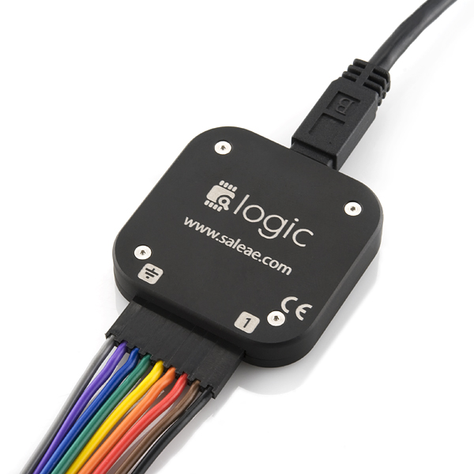
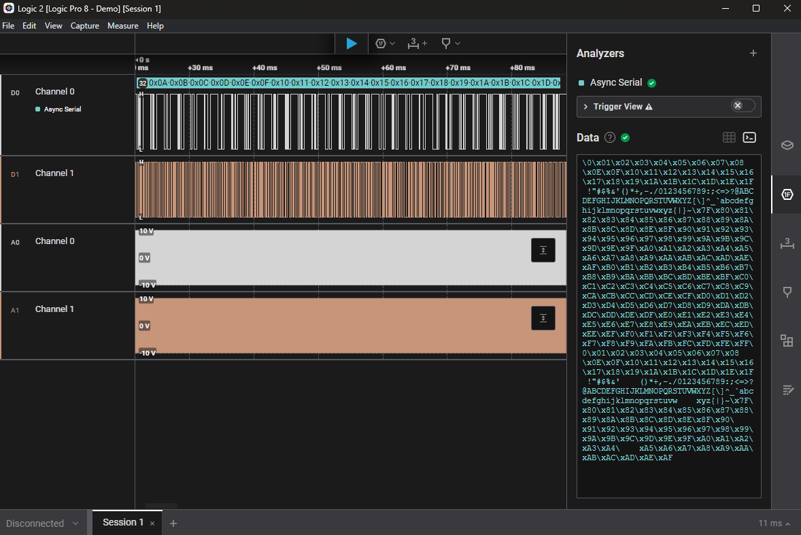

## Table of Contents
- [Firmware Onboarding](#firmware-onboarding)
  - [Software for UGRT Firmware](#software-for-ugrt-firmware)
    - [Linux (Ubuntu) - More info](#linux-ubuntu---more-info)
    - [Git and GitHub - More info](#git-and-github---more-info)
    - [STM32 Cube IDE](#stm32-cube-ide)
    - [VS Code](#vs-code)
  - [Other Tools](#other-tools)

# Firmware Onboarding
**Firmware** is a form of software used for the interfacing of hardware devices. For example, using a microcontroller to control a motor or handling input/output of a keyboard.

## Software for UGRT Firmware
### Linux (Ubuntu) - [More info](./Info/Linux.md)
Some parts of the Rover, such as the NVIDIA Jetson, use Ubuntu as their OS. When working on something that will run on one of these parts, it is usually easier to develop and test on Ubuntu to prevent issues when loading your program on the actual machine.

You can install Ubuntu on a virtual machine, dual boot with Windows, or use WSL (Windows Subsystem for Linux). More information on Linux and how to install it can be found in [Info/Linux.md](Info/Linux.md) of this repository.

### Git and GitHub - [More info](./Info/Git.md)
Git is a version control system often used in the development and collaboration of source code.

GitHub uses Git to manage code repositories, but has extra features to help with task management and graphical management of the repository. 

Instructions and further resources for Git and GitHub are in [Info/Git.md](Info/Git.md).

### STM32 Cube IDE
[STM32 Cube IDE](https://www.st.com/en/development-tools/stm32cubeide.html) is an eclipse-based IDE for development of software used on the STM32. It comes with the build toolchain necessary and allows for easy debugging. It is recommended you use this for flashing and debugging the STM32, it also has some useful code generation features that will take care of alot of the more repetitive work for you. It allows you to select the board you are developing for, any peripherals of the board, and generates definitions you can use instead of having to figure out the address of any peripheral you're using. *Even if you choose to use a different editor for development, this should be used for initial project creation*.

### VS Code
You can use whatever editor you are comfortable with, but [VS Code](https://code.visualstudio.com/download) is very popular and has a large extension marketplace and is very easy to setup and customize.

## Other Tools
Since you are also working with hardware, there are other tools that will be useful for debugging and testing your firmware such as:
- ### Oscilloscope
  - Used to measure *analog* signals
  - View signals in real time
  - Analyse the stability and integrity of a signal
  - Know specific signal amplitudes, power, current, etc...
- ### Logic Analyzer
  - Measure *digital* signals on multiple channels
  - Record signals over period of time
  - Anaylzer software offers features like protocol analyzers which are very useful for debugging logical errors in your firmware
- ### Power supply and Function Generators
  - Lots of hardware needs an external power source or a higher voltage than USB can provide
  - Function generators can generate signals useful for testing the behaviour of your system
- ### Common Electrical Components and Tools
  - A Multimeter is a simple, useful tool you can use to easily check if there is even a current at a location or if a component is working
  - Jumper cables, breadboards, and basic electrical parts like buttons or switches allow easy testing and prototyping before connecting your component to other parts.

| *Salae Logic Analyzer*| *Salae Logic 2 software decoding serial communication signal*|
|:-:|:-:|
